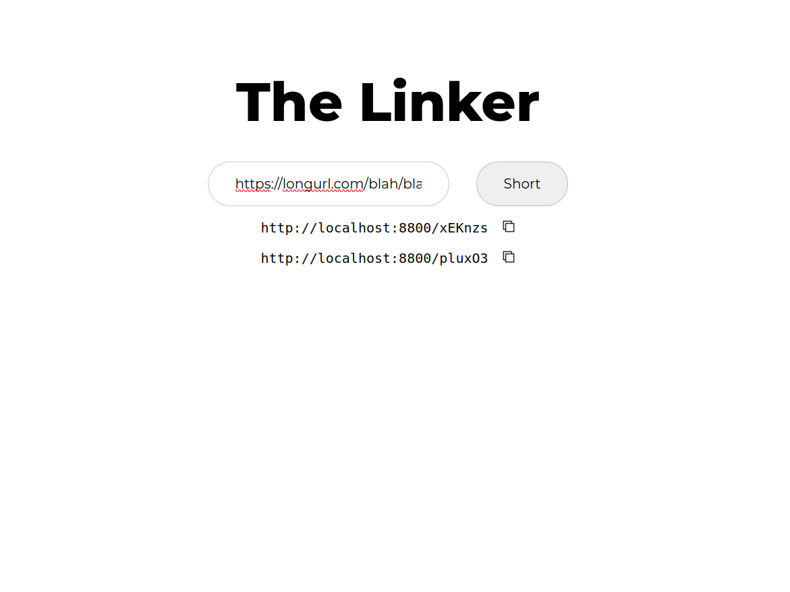

# Url Shortener



Shorten long urls into https://<yourdomain.com>/123abC like urls.

## Installation and setup

Install:

- [docker](https://www.docker.com/)
- [go](https://go.dev/)
- [node](https://nodejs.org/en)
- [pnpm](https://pnpm.io/)

Initialise stateless postgresql instance

```
sudo docker run --name socialplus -e POSTGRES_USER=socialplus -e POSTGRES_PASSWORD=socialplus123 -p 5432:5432 -d postgres:14.5
```

Run backend server:

```
cd <PROJECT_ROOT>/src/server/
go run *.go
```

Run frontend:

```
cd <PROJECT_ROOT>/src/site
pnpm i --frozen-lockfile
pnpm dev
```
